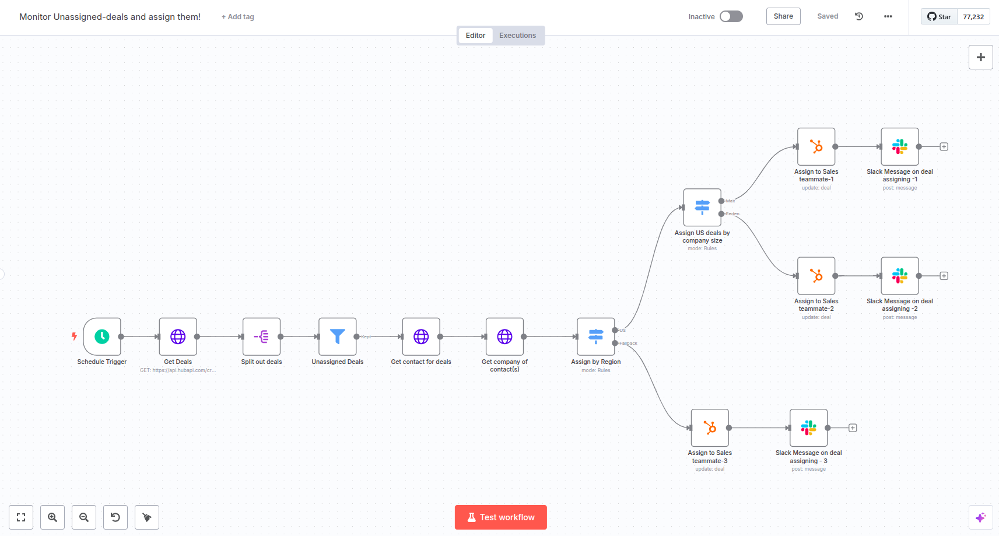

# Workflow to Monitor and Assign the Unassigned Deals to the Sales Team

## Use Case
### Pain Points
- Manual monitoring of unassigned deals is time-consuming
- Deals can remain unassigned for extended periods
- Risk of leads going cold due to delayed assignment
- Inconsistent deal distribution among sales representatives
- No standardized process for deal assignment based on company characteristics
- Manual assignment process prone to human error

### Goal
Automate the monitoring and assignment of unassigned deals in HubSpot to ensure timely follow-up and efficient distribution among sales representatives based on predefined criteria.

## What This Workflow Does

*Workflow visualization showing the automated deal assignment process*

This automated workflow:
1. **Regular Monitoring**: 
   - Runs every 2 days at 7 AM
   - Fetches all deals from HubSpot
   - Identifies unassigned deals

2. **Data Enrichment**:
   - Retrieves associated contact information
   - Fetches company details
   - Gathers company size and region data

3. **Smart Assignment Logic**:
   - **Region-Based Routing**:
     - Separates country-based deals from other regions
   - **Company Size Segmentation**:
     - ≤ 999 employees: Assigned to Sales Teammate 1
     - ≥ 1000 employees: Assigned to Sales Teammate 2
   - **Fallback Assignment**:
     - Deals that don't fall in any category are assigned to Sales Teammate 3

4. **Notification System**:
   - Sends Slack notifications to assigned sales representatives
   - Includes deal information in notifications

## Requirements

### 1. Platform Access
- n8n instance (cloud or self-hosted)
- HubSpot CRM account with admin access
- Slack workspace

### 2. API Credentials
- HubSpot OAuth2 API credentials (w.r.t. cloud instance)
- HubSpot Token (w.r.t. self-hosted instance)
- Slack OAuth2 API credentials (w.r.t. cloud instance or self-hosted instance)

### 3. Team Setup
- Configured sales team members in HubSpot
- Sales representatives' Slack user IDs
- Defined assignment criteria and rules (modify as per the requirement)

## Setup Instructions

### 1. Import Workflow
- Download `Monitor_Unassigned_deals_and_assign_them_.json`
- Navigate to n8n: Workflows → Import From File
- Select the downloaded JSON file

### 2. Configure HubSpot Integration
1. Access HubSpot Developer Portal
2. Create new OAuth2 credentials:
   - Configure redirect URLs
   - Set appropriate scopes for deal management
3. In n8n HubSpot nodes (w.r.t. cloud instance):
   - Add OAuth2 credentials
   - Verify API access
   In n8n HubSpot nodes (w.r.t. self-hosted instance):
   - Add Hubspot Token

### 3. Setup Slack Integration
1. Create Slack App:
   - Enable necessary permissions
   - Generate OAuth tokens
2. In n8n Slack nodes:
   - Add Slack credentials
   - Verify user IDs for notifications

### 4. Customize Assignment Logic
1. **Region Assignment**:
   - Review region filtering in "Assign by Region" node
   - Adjust country conditions if needed

2. **Company Size Rules**:
   - Modify employee count thresholds

3. **Sales Team Configuration**:
   - Update HubSpot owner IDs
   - Configure Slack user IDs
   - Set fallback assignment rules

### 5. Schedule Configuration
- Verify schedule trigger settings
- Adjust timing if needed (default: every 2 days at 7 AM)

### 6. Testing
1. Run workflow in manual mode
2. Verify deal assignments
3. Check Slack notifications
4. Monitor error handling

## Security Reminders
- Store credentials securely
- Use environment variables
- Regularly rotate API keys

## Important Notes
- **Save Changes**: Always save workflow after modifications
- **Testing**: Test in development environment first
- **Monitoring**: Regular check of workflow execution
- **Maintenance**: Keep n8n and nodes updated
- **Documentation**: Update assignment rules documentation as needed

## Troubleshooting Tips
- Verify API credentials if connections fail
- Make sure to add the associated contacts and companies in HubSpot on deal creation
- Check HubSpot permissions for deal assignment
- Confirm Slack user IDs are correct
- Monitor workflow execution logs
- Review deal assignment criteria if deals are misrouted

Remember to save your workflow after any modifications to prevent losing changes!