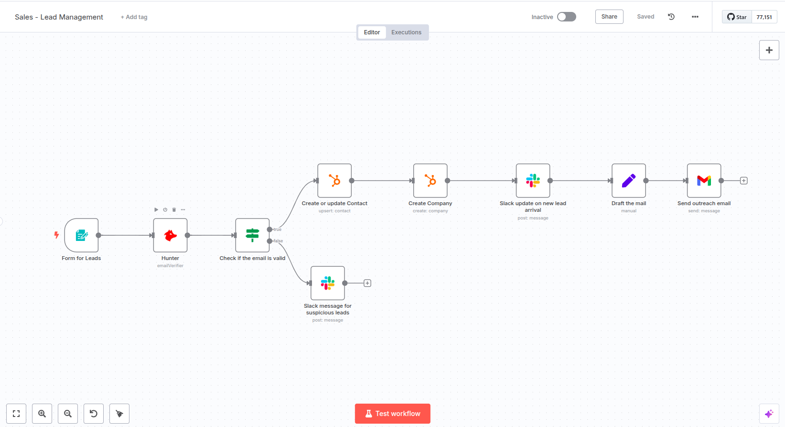

# SalesReady - Verified Lead Engine

## Use Case
### Pain Points
- Manual lead verification is time-consuming and error-prone
- Delayed response to potential leads can result in lost opportunities
- Inconsistent lead data entry across different platforms
- Risk of engaging with leads using invalid email addresses
- Lack of immediate team notification when new leads arrive

### Goal
Automate the entire lead management process from form submission to lead verification, CRM entry, and team notification while ensuring data quality and quick response times.

## What This Workflow Does
This automated workflow streamlines the lead management process by:
1. Capturing lead information through a customized form
2. Verifying email authenticity using Hunter.io
3. Creating/updating contact and company records in HubSpot
4. Sending notifications via Slack for both valid and suspicious leads
5. Automatically sending acknowledgment emails to verified leads

### Sales Lead Management Workflow

*Workflow visualization showing the automated lead management process*

### Workflow Steps
1. **Lead Form Submission**: Collects comprehensive lead information including:
   - Personal details (name, email, contact number)
   - Company information (name, size, location)
   - Business requirements and pain points

2. **Email Verification**: 
   - Hunter.io checks email validity
   - Suspicious emails are flagged and reported separately

3. **CRM Integration**:
   - Creates/updates contact in HubSpot
   - Creates associated company record
   - Maintains data consistency

4. **Team Notifications**:
   - Alerts sales team about new leads via Slack
   - Separate channel for suspicious leads
   - Immediate visibility for quick follow-up

5. **Lead Communication**:
   - Automated acknowledgment email to valid leads
   - Professional communication maintaining brand voice

## Requirements
1. **n8n Instance**:
   - Self-hosted or cloud instance
   - Latest version recommended

2. **Required Accounts**:
   - HubSpot CRM account
   - Hunter.io account
   - Slack workspace
   - Gmail account for sending emails

3. **API Access**:
   - HubSpot API credentials
   - Hunter.io API key
   - Slack OAuth credentials
   - Gmail OAuth setup

## Setup Instructions

### 1. Import Workflow
- Download the `Sales___Lead_Management.json` file
- In n8n: Go to Workflows → Import From File
- Select the downloaded JSON file

### 2. Configure Credentials

#### HubSpot Setup
1. Go to HubSpot Developer Portal
2. Create a new OAuth app
3. Add credentials in n8n HubSpot node
4. Verify API scopes for contacts and companies

#### Hunter.io Setup
1. Login to Hunter.io account
2. Generate API key
3. Add API key to Hunter node in n8n

#### Slack Setup
1. Create new Slack app in your workspace
2. Enable necessary permissions
3. Create two channels:
   - New lead alerts
   - Suspicious leads
4. Add OAuth credentials to Slack nodes

#### Gmail Setup
1. Configure Gmail OAuth
2. Add credentials to Email node
3. Verify sending permissions

### 3. Customize Form Fields
- Review form fields in Form Trigger node
- Modify fields based on your requirements
- Update field validations if needed

### 4. Test the Workflow
1. Test form submission
2. Verify email verification process
3. Check HubSpot for contact creation
4. Confirm Slack notifications
5. Verify acknowledgment emails

## Security Reminders
- Never share API keys
- Use environment variables when possible
- Regularly rotate API keys

## Important Notes
- Always save your workflow after making changes
- Test the workflow in development environment first
- Monitor Hunter.io API usage limits
- Keep HubSpot API calls optimized
- Regularly check Slack channel configurations

## Maintenance
- Regularly update n8n instance
- Monitor API response times
- Check for failed executions
- Update email templates as needed
- Review and adjust form fields periodically

Remember to save your workflow after any modifications to prevent losing changes!